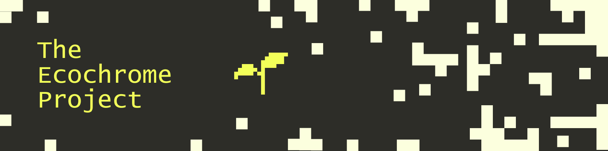

# The Ecochrome Project
The Ecochrome Project is a tool designed to help UX designers and front-end developers visualise a way to contribute towards creating eco-friendly colour palettes. This imaginative tool is intended to help visual designers imagine a future where designing for the environment is a part of the industry standard.

View the website at https://theecochromeproject.netlify.app
